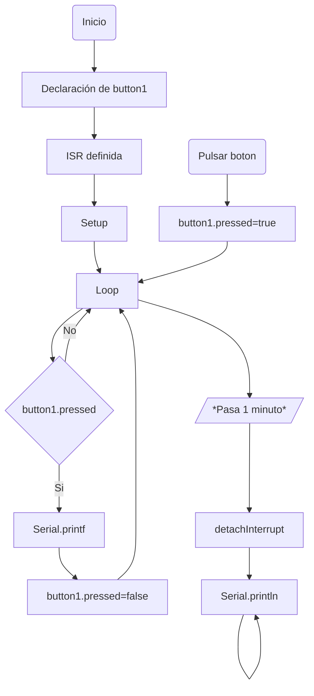
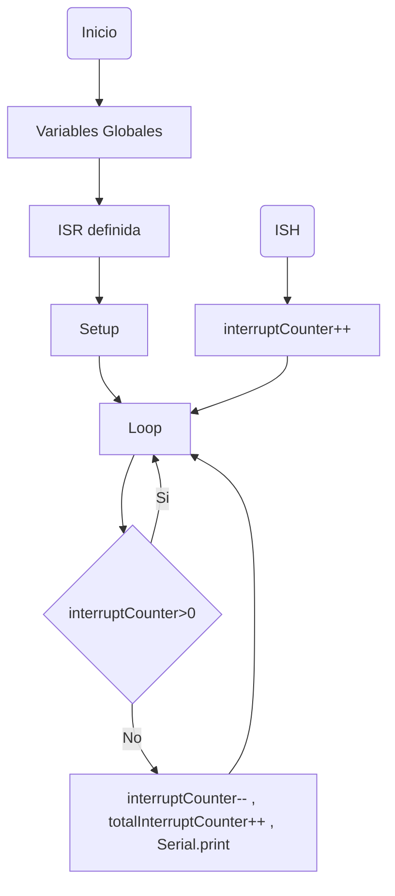

# Informe - Practica 2 #
***
En esta práctica vamos a trabajar con interrupciones (ISH) las cuales, como su nombre indica son interrupciones de la actividad normal del procesador, para ejecutar otra actividad (y posteriormente reanudar la actividad normal).

Para ello vamos a usar dos tipos de eventos los cuales ejecutarán una función (ISR). Estos eventos son:
* Evento hardware (Boton).
* Evento programado (Timer).


## Interrupcion por hardware - Parte A ##
***
Lo primero que debemos hacer es declarar el evento por hardware que deseemos implementar, en este caso un botón.
Declaramos una estructura que almacene el pin que vamos a asignar a la interrupción, una variable que almacene el número de veces que activamos el botón, y una variable booleana que indique si el botón está activado.

```
struct Button {
const uint8_t PIN;
uint32_t numberKeyPresses;
bool pressed;
};
```
Para las dos primeras variables usaremos los tipos definidos uintX_t, el cual será un int sin signo de X bits.

Para continuar usamos la estructura creada para definir el pin GPIO 18 como la entrada para nuestro botón.
```
Button button1 = {18, 0, false};
```
Despues declaramos la función que se ejecutará cuando la interrupción se lleve a cabo, la cual, simplemente, sumará uno a las veces que hemos pulsado el botón, y pondra el booleano a 1.
```
void IRAM_ATTR isr() {
button1.numberKeyPresses += 1;
button1.pressed = true;
}
```
En el ```void setup()``` aparte de declarar la comunicación serie con ```Serial.begin()```, vamos a declarar el pin que hemos usado para la interrupción por botón como un ```INPUT_PULLUP``` el cual es como un INPUT normal pero con una resistencia en *pullup*, para conseguir que mientras no se pulse el botón, la salida de un nivel alto de tensión continuo y no haya rebotes ocasionados por el comportamiento normal del botón.

Además incluiremos lo mas importante para esta práctica, el ```attachInterrupt(button1.PIN, isr, FALLING);```, que es el encargado de vincular el pin con la funcion, y lo pondremos en modo *FALLING* para que cuando el boton se pulse (pasa de HIGH a LOW) se ejecute la interrupcion.

En el ```void loop()``` escribimos un *if* para que cuando la interrupcion se acabe el *if* se active y retorne el booleano a false e imprima por pantalla el número de veces que se ha activado el boton, además habrá otro *if* que se encarga de que cuando pase 1 minuto (60000 ms), ejecute el ```detachInterrupt(button1.PIN);``` e imprima 'Interrupt Detached!' para que haga una separación de interrupciones cuando ya no se quiera que el ESP32 monitorice el pin.


### Código A ###
***
```
#include <Arduino.h>

struct Button {
const uint8_t PIN;
uint32_t numberKeyPresses;
bool pressed;
};

Button button1 = {18, 0, false};

void IRAM_ATTR isr() {
button1.numberKeyPresses += 1;
button1.pressed = true;
}


static uint32_t lastMillis = 0;

void setup() {

Serial.begin(115200);
pinMode(button1.PIN, INPUT_PULLUP);
attachInterrupt(button1.PIN, isr, FALLING);

}

void loop() {

if (button1.pressed) {
  Serial.printf("Button 1 has been pressed %u times\n", button1.numberKeyPresses);
  button1.pressed = false;
}

//Detach Interrupt after 1 Minute
if (millis() - lastMillis > 60000) {
  lastMillis = millis();
  detachInterrupt(button1.PIN);
  Serial.println("Interrupt Detached!");
}

}
```
### Salida del código A ###
***
```
[...]
Button 1 has been pressed 8701 times
Button 1 has been pressed 8710 times
Button 1 has been pressed 8713 times
Button 1 has been pressed 8715 times
Button 1 has been pressed 8716 times
Interrupt Detached!
```

### Diagrama de flujo A ###
***


## Interrupcion por Timer - Parte B ##
***
La variable de contador de interrupciones ```volatile int interruptCounter;``` debe ser declarada como **volatile** para que no sea eliminada debido a las optimizaciones del compilador, ya que se compartirá entre el loop principal y el ISR.

Para configurar el timer, necesitaremos un puntero a una variable de tipo ```hw_timer_t```, que luego usaremos en el ```void setup()```.

Aun dentro de la declaración de las variables globales, declaramos el ```portMUX_TYPE timerMux``` que nos servirá de dirección para poder manipular la variable ```interruptCounter``` dentro de una sección crítica (*critical section*) dado que va a ser usada por la funcion del *ISR* y por el *void loop*.

Posteriormente creamos la función que se ejecutará cuando la interrupción se lleve a cabo, con el atributo ```IRAM_ATTR``` para que la función se cargue en la RAM en vez de en memoria *flash* para que esta función se pueda ejecutar más rápido y la interrupción se lleve a cabo en menos tiempo.

Dentro de la función ```onTimer()```, tendremos que abrir la sección crítica en la dirección *timerMUX* (```portENTER_CRITICAL_ISR(&timerMux);```), en nuestro caso la función sumará 1 al contador de interrupciones que posteriormente será decrementado en el ```void loop()```, y finalmente salimos de la sección crítica con: ```portEXIT_CRITICAL_ISR(&timerMux);```.

En el ```void setup()```, obviando el ```Serial.begin(115200)```, inicializaremos el timer que generamos antes, ```timer = timerBegin(0, 80, true);``` de este modo generaremos un timer en la posición 0 (Como el ESP32 tiene 4 timers por hardware, estos van de 0 a 3), le diremos *true* para que vaya contando para arriba (sumando) o *false* si queremos que haga un *countdown*, y finalmente ponemos los preescaladores del timer a 80, dado que la frecuencia de la señal base del ESP32 es de 80MHz, si ponemos el preescalador a 80 este dividirá la señal, consiguiendo así un contador con una frecuencia de 1MHz.

Una vez inicializado el timer debemos crear la interrupción, para ello usaremos la función ```timerAttachInterrupt(timer, &onTimer, true)```, dado que es producido por un timer, en la función introduciremos primero el timer que queremos que tenga en cuenta, la función ISR, y true para que sea un *edge trigger* y la interrupción se produzca en el flanco de subida del *clock* del timer.

Usaremos ```timerAlarmWrite(timer, 1000000, true);``` para decirle al progama el valor del contador donde queremos que se ejecute la interrupción, esto significa que como el timer se activará 1.000.000 de veces por segundo el *timerAlarmWrite()* con un *count value* (segundo argumento) de 1.000.000 hará que la interrupción se lleve a cabo cada segundo, porque tendrá que activarse un millón de veces el timer antes de hacer la interrupción, además le diremos *true* en el tercer argumento para que se reincie el *count value* y la ejecución sea periódica.

Para acabar con el ```void setup()``` habilitaremos la alarma creada con todas estas características: ```timerAlarmEnable(timer);```.

Finalmente dentro del ```void loop()``` usaremos *polling* en vez de semáforos para ver el valor del contador, si este contador es mayor que 0, hará que se ejecute primero en una sección crítica el drecremento del contador dando a entender así que se ha recibido la interrupción y nos hemos hecho cargo de ella, además de simplemente el contador global de interrupciones y la impresión por pantalla de este contador.


### Codigo B ###
***
```
#include <Arduino.h>

volatile int interruptCounter;
int totalInterruptCounter;

hw_timer_t * timer = NULL;
portMUX_TYPE timerMux = portMUX_INITIALIZER_UNLOCKED;

void IRAM_ATTR onTimer() {
  portENTER_CRITICAL_ISR(&timerMux);
  interruptCounter++;
  portEXIT_CRITICAL_ISR(&timerMux);
};

void setup() {

  Serial.begin(115200);

  timer = timerBegin(0, 80, true);
  timerAttachInterrupt(timer, &onTimer, true);
  timerAlarmWrite(timer, 1000000, true);
  timerAlarmEnable(timer);

}

void loop() {
  
  if (interruptCounter > 0) {
    portENTER_CRITICAL(&timerMux);
    interruptCounter--;
    portEXIT_CRITICAL(&timerMux);
    totalInterruptCounter++;
    Serial.print("An interrupt as occurred. Total number: ");
    Serial.println(totalInterruptCounter);
  }

}
```

### Salida del código B ###
***
```
An interrupt as occurred. Total number: 1
An interrupt as occurred. Total number: 2
An interrupt as occurred. Total number: 3
An interrupt as occurred. Total number: 4
An interrupt as occurred. Total number: 5
[...]
```
### Diagrama de flujo B ###
***

 
